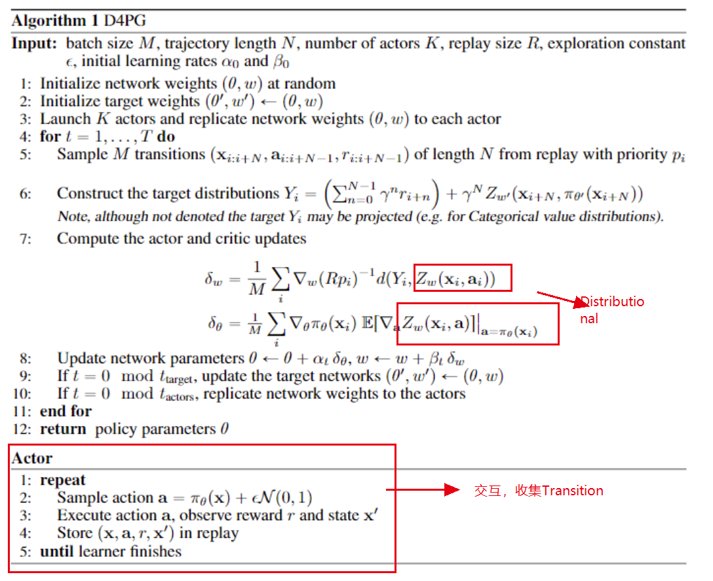
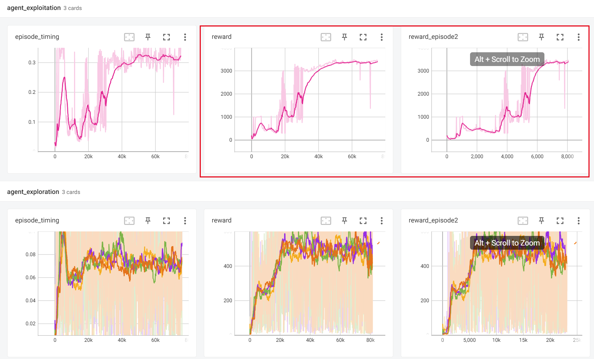
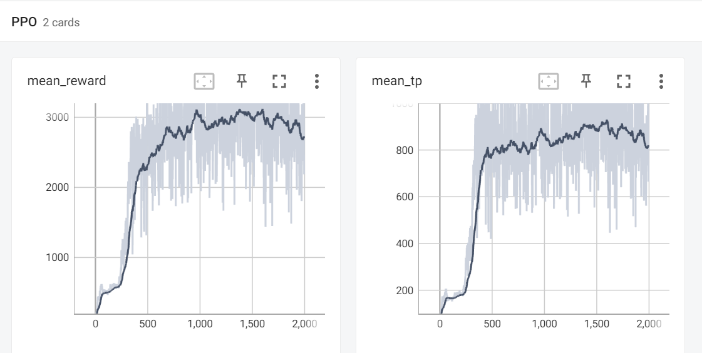

## Distributed Distributional Determinisitic Policy Gradient

[Barth-Maron, Gabriel, et al. &#34;Distributed distributional deterministic policy gradients.&#34; arXiv preprint arXiv:1804.08617 (2018).](https://link.zhihu.com/?target=https%3A//arxiv.org/pdf/1804.08617)

### D4PG伪代码

### Main Contributions of D4PG

- D4PG将经验收集的Actor和策略学习的Learner分开：

  - 使用多个并行的Actor进行数据收集，即分布式的采样；
  - 分享一个大的经验数据缓存区，发送给Learner进行学习，Learner从Buffer中采样，将更新后的权重在同步到各个Actor上（ApeX)；
  - 使用TD(N-steps)的方式进行处理，减小Bias；
  - 可以使用PER技术（优先经验回放）；
  - Critic输出是分布( Distributional ), 使用价值函数分布，目标函数为

    $$
    L(w)=\mathbb{E}_{\rho}\left[d\left(\mathcal{T}_{\pi_{\theta^{\prime}}} Z_{w^{\prime}}(\mathbf{x}, \mathbf{a}), Z_{w}(\mathbf{x}, \mathbf{a})\right)\right]

    $$

    - $\tau_{\pi}$ ---- Distributional Bellman Operator;
    - $d$ ---- Cross Entropy; 度量分布的距离;
- D4PG的改进使得我们可以**运用上百台甚至更多的机器资源**，这样就能够采样更多用于训练的数据，比DPPO更好的地方在于Learner**不需要等待Actor计算梯度**，真正实现了样本采集和训练过程的分离。
- 工程实现

  - [[D4PG-Pytorch Github Repo]]([d4pg-pytorch](https://github.com/schatty/d4pg-pytorch))
  - Learner 、 Sampler 、 Agents 分别运行在不同的Process中；
  - 利用者在执行action时，是没有noise的，他们主要用在Target Network上；
  - 只有利用者会需要用到GPU，其他的探索进程都运行在CPU上；

### D4PG Improvements

D4PG缺点在于Actor和Learner的分离可能导致**学习到的策略和正在执行的策略产生差距**，因此在一个不是很好的策略下采集到的样本也不好，D4PG没有解决两者的平衡问题。

### D4PG Results(Hopper-v2)

感觉和PPO完全体还有一些差距... 

