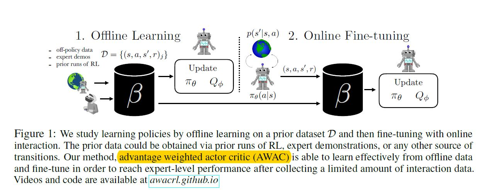
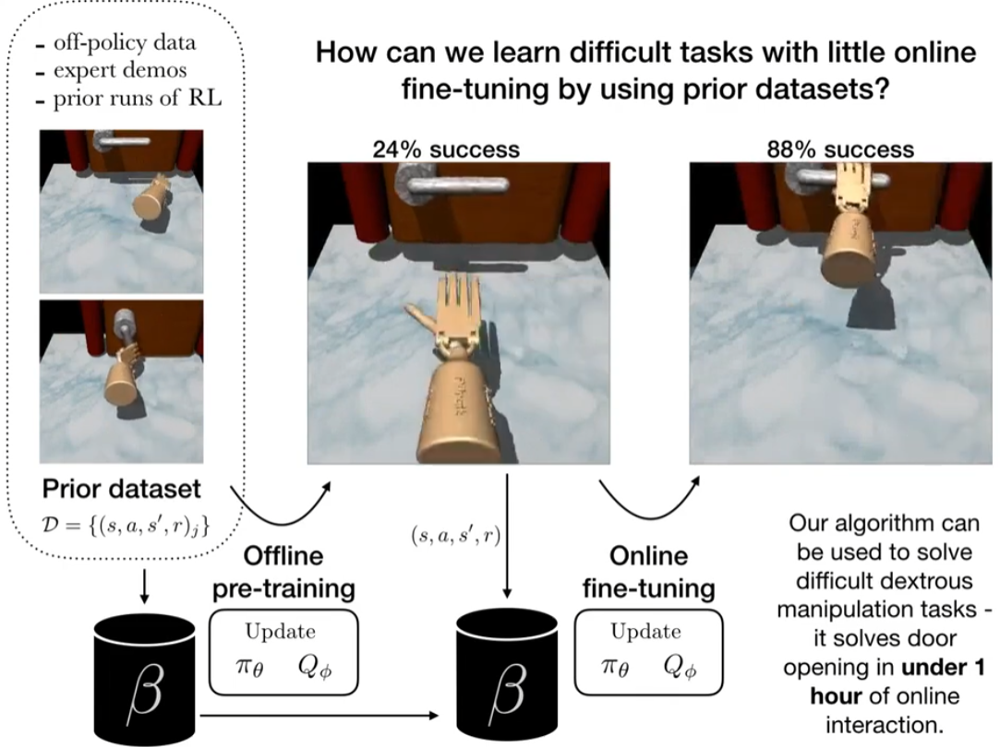
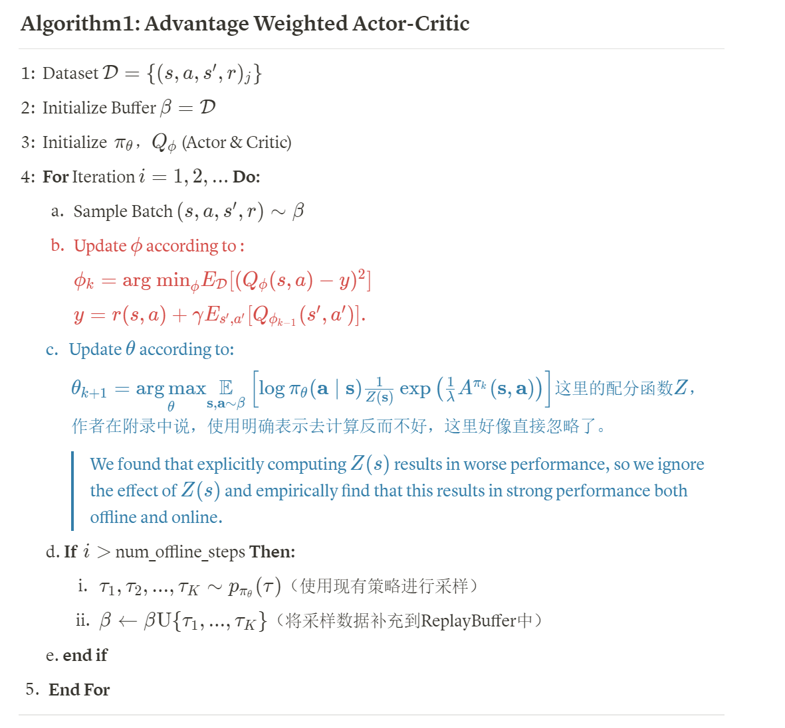
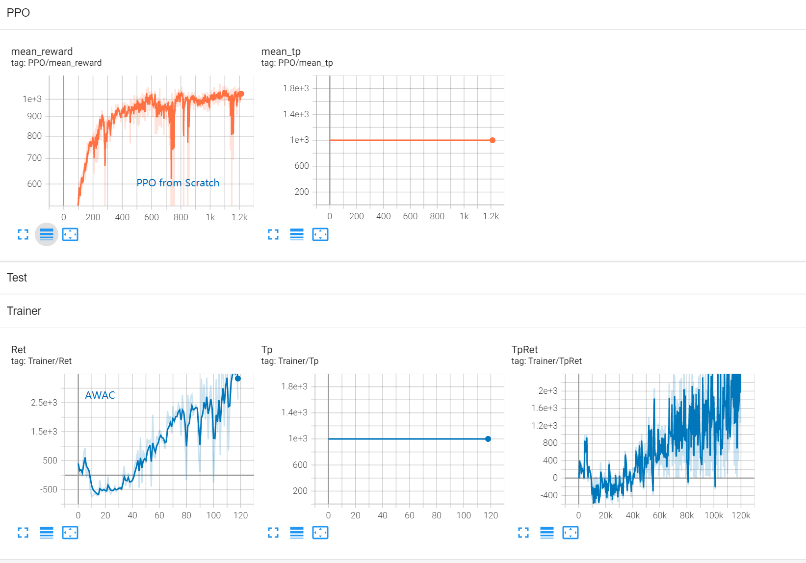

### AWAC(From Offline2Online系类)

AWAC:  Trains well off-line, fine-tunes quickly online, and does not need to estimate a behavior model.

AWAC主要是想利用过来的一些Offline Datasets来加快/提升最终的性能，Offline数据可以是专家数据，或者是一些次优数据，或者是其他Policy学出来的数据都可以。

---

**Accelerating Online Reinforcement Learning with Offline Datasets(AWAC)**

### REFS

- Paper:  [https://arxiv.org/abs/2006.09359](https://arxiv.org/abs/2006.09359) 原论文
- [https://zhuanlan.zhihu.com/p/344806838](https://zhuanlan.zhihu.com/p/344806838) [知乎:**Online RL with offline data**]
- [http://www.jingtianrobots.com/index.php?id=637](http://www.jingtianrobots.com/index.php?id=637)  [**AWAC：使用离线数据集加速在线强化学习**]
- [https://zhuanlan.zhihu.com/p/349768731](https://zhuanlan.zhihu.com/p/349768731) [**Offline RL(1): AWAC**]
- https://awacrl.github.io/
- 🚀️ 🚀️ 🚀️ [hari-sikchi](https://github.com/hari-sikchi)/**[AWAC](https://github.com/hari-sikchi/AWAC)**
  - Offline Mixture Data Download: [Google Drive](https://drive.google.com/file/d/1edcuicVv2d-PqH1aZUVbO5CeRq3lqK89/view)

#### ① 细节分析

PDF Link:

#### Pcode

#### 实验数据AWAC vs. All tricks PPO from Scratch

