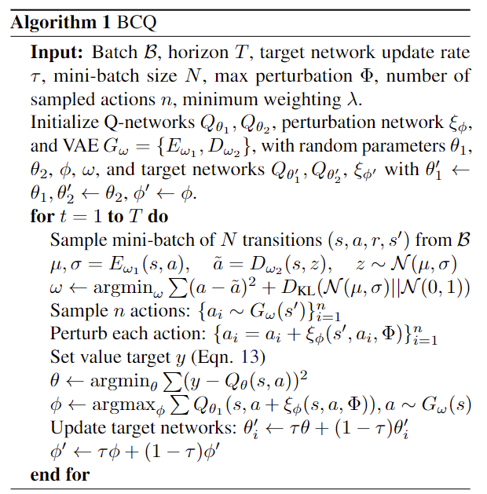
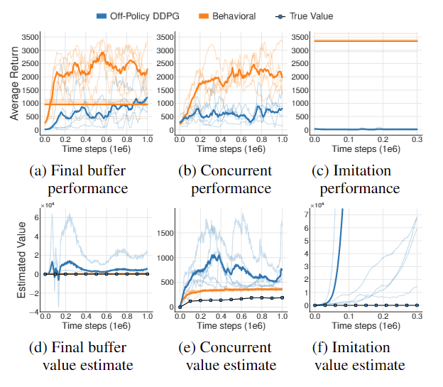

## Batch-Constrained deep Q- Learning(BCQ)

### PCode

### REFS

- [【论文笔记】Batch-Constrained deep Q- Learning(BCQ)](https://zhuanlan.zhihu.com/p/63332217)
- [原文](https://arxiv.org/pdf/1812.02900)
- Official Github: [BCQ](https://github.com/sfujim/BCQ)
- [机器学习理论—优雅的模型（一）：变分自编码器（VAE）](https://)

### KeyPoints

1. Batch RL，只利用Replay Buffer中的Transitions进行学习而无需Exploration，也无需与Env进行交互；
2. 利用任意策略（可以不止一种）采样得到的离线数据学习在该环境中的最优策略；而不是模仿采样示例的所谓“专家数据”。
3. 主要用于Continuous Action Space Task；因为难以对连续动作空间进行完全采样。
4. ***Motivation***

   - 
   - Off-Policy RL有 Growing Batch Learning的Issue，作者验证了当前数据与当前策略不相关，即采样用到的策略与当前策略差别很大时，Off-Policy算法不work，实验说明得到的策略甚至不如behavioral的策略（即用来采样得到经验池数据的策略）。
     - 数据分布很不一致的情况时，SOTA Off Policy表现糟(如Final Buffer情况、Concurrent情况、Imitation情况)。这几种情况下，数据分布不一致，Final Buffer时，直接训一个DDPG 100,0000 tps; Concurrent时，训练几个DDPG，采样数据一起学习；Imitation用一个Pre-trainedDDPG agent专家，采样100,0000 tps.
5. ***Extrapolation Error***

   - introduced by the ***mismatch*** between the dataset and true state-action visitation of the current policy;即不同策略采样的分布不同，计算Q/V时候有关概率也有差别。
   - 推断误差:错误的估计状态值或者状态动作值；
   - 本质上来源于经验池中的数据分布与当前策略不一致。
     - 比如，如果经验池中没有选择某个动作的样本，我们不可能学到选择了该动作的策略。
6. ***BCQ***

   - Batch-Constrained deep Q- Learning

     - Batch-Constrained: 在batch的限制下选择策略；
     - 选择策略的时候要使得state-action 分布和batch相似。
   - 利用state-conditioned generative model提供先前见过的动作（即**选择的策略和经验池更相关**）。
   - 证明了在一些假设下，这样的batch-constrained条件，是要从不完整的数据集中学习有限、确定性MDP的value的无偏估计的必要条件。
   - BCQ考虑了extrapolation error，因此可以从任意数据中学习，不仅可以从专家数据，也可以从一般的sub optimal数据学习。
   - BCQ

     - 优化Value函数时候加入future uncertainty的衡量；
     - 加入了距离限制，通过state-conditioned generative model完成；
     - Q网络选择最高价值的动作；
     - 在价值更新时候，利用Double Q的估计取soft minimum;
       $r+\gamma max_{a_i}[\lambda min_{j=1,2}Q_{\theta'_j}(s',a_i)+(1-\lambda)max_{j=1,2}Q_{\theta'_j}(s',a_i)$
       是Convex Combination 而不是 Hard Minimum ...
   - BCQ网路组成:

     - 两个Q&两个TargetQ;
     - 一个扰动网络&Target扰动网络(提供action的多样性，采样一定区间内的动作，而不只是生成器生成的动作）;
     - VAE生成模型;
   - BCQ训练过程

     - 采样 From Batch;
     - 训练VAE,生成和Batch中相似的action;
     - 从生成器中采样，用扰动Net取值；
       上述过程:

       $$
       \begin{aligned}
       \pi(s)=& \underset{a_{i}+\xi_{\phi}\left(s, a_{i}, \Phi\right)}{\operatorname{argmax}} Q_{\theta}\left(s, a_{i}+\xi_{\phi}\left(s, a_{i}, \Phi\right)\right) \\
       &\left\{a_{i} \sim G_{\omega}(s)\right\}_{i=1}^{n}
       \end{aligned}

       $$

       $\Phi$和$n$提供了Imitation Learning & RL的Trade-Off;

       - $\Phi=0 $ and $n=1$ 变成BC;
     - 更新Q和Target Q;
7. BCQ只可以从有限数据中学习，不与环境交互，可以学习到的Optimal Policy应该是有上界的。
