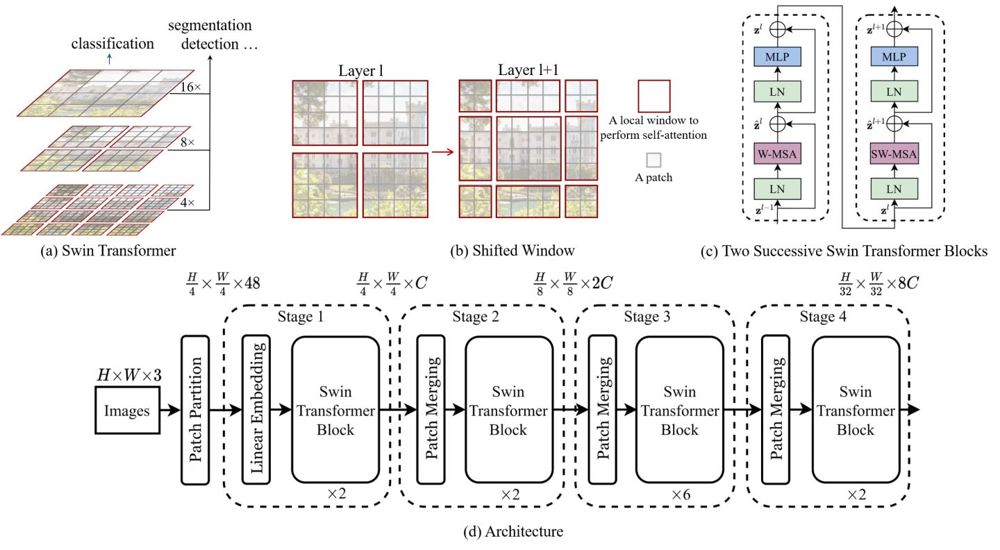

## Swin Transformer实现

Swin Transformer 被视为CNN的理想替代方案，其在设计时也融合了很多CNN的思想。

### SwinT vs. ViT

Swin Transformer相比于ViT做了下列改进：

- 结合CNN思想，引入层次化构建方式构建层次化的Transformer，使得SwinT可以做层级式的特征提取（方便下游多尺度的检测、分割任务）。证明了Swin Transformer可以作为通用的视觉任务Backbone网络。
- W-MSA局部窗口注意力有利于减少计算量。ViT中，全局自注意力会产生平方倍的复杂度，W-MSA这种，使得复杂度与图片大小变为线性关系。
- 在分类实现过程中，ViT会单独加上一个可学习参数【CLS】，作为分类的Token，而Swin-T则是通过nn.AdaptiveAvgPool1d直接做平均，输出分类，类似于CNN最后的全局平均池化层。
- SW-MSA中shifted window让相邻的两个窗口之间有了交互，产生了通信，所以上下层之间就可以有 cross-window connection，从而变相的达到了一种全局建模的能力。
- Swin Transformer通过Patch Merging达到CNN中Pooling的操作效果，就是把相邻的小 patch 合成一个大 patch，这样合并出来的这一个大patch其实就能看到之前四个小patch看到的内容，它的感受野就增大了，同时也能抓住多尺寸的特征。

### 细节介绍

[知乎: DLPlayGround之Swin-Transformer(v1)](https://zhuanlan.zhihu.com/p/467158838)

### Refs

[灰墙：Transformer结构中获得相对位置信息的探究](https://zhuanlan.zhihu.com/p/100112141)

[SOTA模型Swin Transformer是如何炼成的!](https://toutiao.io/posts/e0unlgm/preview)

[陀飞轮：Swin Transformer对CNN的降维打击](https://zhuanlan.zhihu.com/p/360513527)

[论文Swin Transformer Arxiv](https://arxiv.org/abs/2103.14030)

[Microsoft官方Repo](https://github.com/microsoft/Swin-Transformer)

[Swin Transformer论文精读【论文精读】_哔哩哔哩_bilibili](https://www.bilibili.com/video/BV13L4y1475U/?spm_id_from=autoNext)

[zzzk：图解Swin Transformer](https://zhuanlan.zhihu.com/p/367111046)

[https://github.com/WZMIAOMIAO/deep-learning-for-image-processing](https://github.com/WZMIAOMIAO/deep-learning-for-image-processing)

[Swin-Transformer网络结构详解_霹雳吧啦Wz-CSDN博客_swin transformer结构](https://blog.csdn.net/qq_37541097/article/details/121119988)
