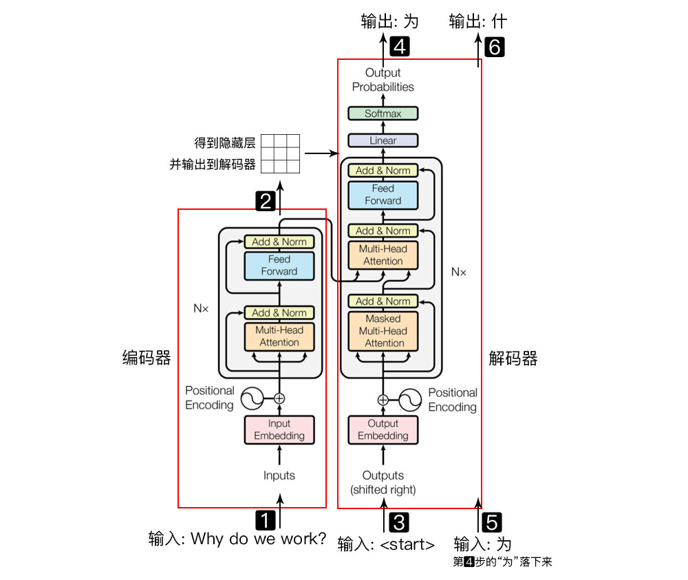

## TransformerBasic

`图片引用--https://wmathor.com/index.php/archives/1438/`

### 主要涵盖了以下内容实现：

#### Main Features

- 模型全部由Linear Layers+Attention Mechanisms+Norm层组成
- 截至目前，是最主流的一种Basic Model

#### 与原来的代码库相比:

- 使用学习过的位置编码而不是Static Pattern.
- 我们使用具有静态学习率的标准 Adam 优化器，而不是带有Warm-up和Cool-down步骤的优化器.
- 不使用标签平滑.

#### (1) Encoder

- Positional Encoding
- Attention Machanism
- Trick --- Padding Mask
- Add & Norm Layer

#### (2) Decoder

- Masked Self-Attention
- Masked Encoder-Decoder Attention

### 常见问题

#### 🚀️Transformer为什么要进行Multi-Head Attention

1. `原论文中说到进行 Multi-head Attention 的原因是将模型分为多个头，形成多个子空间，可以让模型去关注不同方面的信息，最后再将各个方面的信息综合起来。其实直观上也可以想到，如果自己设计这样的一个模型，必然也不会只做一次 attention，多次 attention 综合的结果至少能够起到增强模型的作用`
2. `类比CNN中同时使用多个卷积核的作用，直观上说，多头注意力有助于网络捕捉更丰富的特征/信息`

#### 😄 Transformer 类比 RNN/LSTM，有什么优势？为什么？

1. `RNN 系列的模型，无法并行计算，因为 T 时刻的计算依赖 T-1 时刻的隐层计算结果，而 T-1 时刻的计算依赖 T-2 时刻的隐层计算结果`
2. `Transformer 的特征抽取能力比 RNN 系列的模型要好`
3. `克服遗忘问题(长序列遗忘)`

#### 😄为什么说 Transformer 可以代替 seq2seq?

1. `seq2seq 最大的问题在于将 Encoder 端的所有信息压缩到一个固定长度的向量中，并将其作为 Decoder 端首个隐藏状态的输入，来预测 Decoder 端第一个单词 (token) 的隐藏状态。在输入序列比较长的时候，这样做显然会损失 Encoder 端的很多信息，而且这样一股脑的把该固定向量送入 Decoder 端，Decoder 端不能够关注到其想要关注的信息。`
2. `Transformer 不但对 seq2seq 模型这两点缺点有了实质性的改进 (多头交互式 attention 模块)，而且还引入了 self-attention 模块，让源序列和目标序列首先 “自关联” 起来，这样的话，源序列和目标序列自身的 embedding 表示所蕴含的信息更加丰富，而且后续的各层也增强了模型的表达能力.`
3. `Transformer 并行计算的能力远远超过了 seq2seq 系列模型`.

### Refs

1. [Transformer详解](https://wmathor.com/index.php/archives/1438/)
2. [pytorch-seq2seq Git Repo](https://github.com/bentrevett/pytorch-seq2seq/blob/master/6%20-%20Attention%20is%20All%20You%20Need.ipynb)
3. [小白学习笔记---Pytorch之Seq2Seq: Transformer](https://zhuanlan.zhihu.com/p/387957776)
