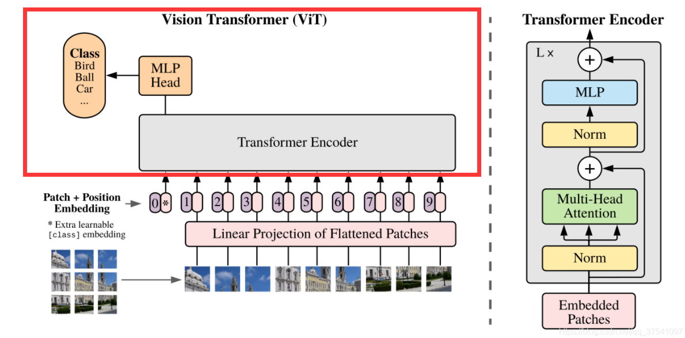
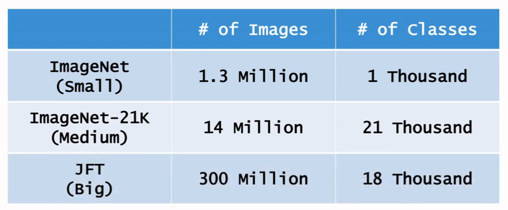
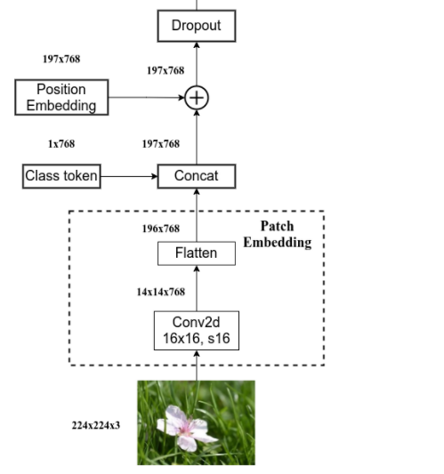
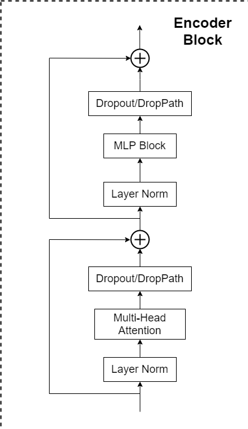
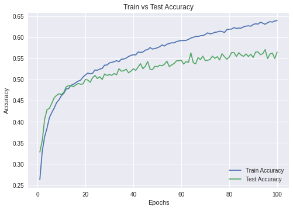
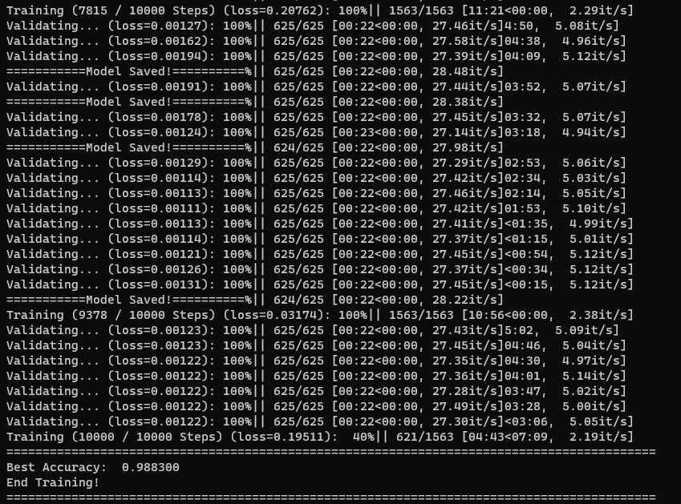
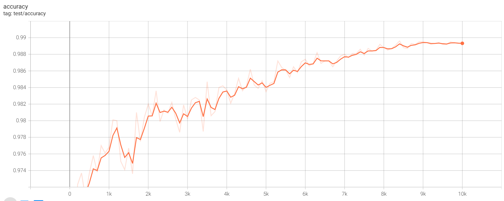

## VIT - Vision Transformer

👍 [Paper: An image is worth 16×16 words: transformers for image recognition at scale](https://arxiv.org/pdf/2010.11929.pdf)


### Refs

[【小白学习笔记】Pytorch之Vision Transformer(ViT)，CIFAR10图像分类, Colab 源码分享](https://zhuanlan.zhihu.com/p/448687823)

[谷歌大脑提出新型激活函数Swish惹争议：可直接替换并优于ReLU？（附机器之心测试）](https://zhuanlan.zhihu.com/p/30332306)

[vit-pytorch](https://github.com/lucidrains/vit-pytorch)

[Vision-Transformer](https://github.com/ra1ph2/Vision-Transformer)

### Key Points

- VIT是Transformer在CV图片分类种的一种应用，VIT的实验结论是，在预训练Dataset足够大的前提下，所有数据集的表现是超过ResNet的。
- VIT的本质就是一个Transformer的Encoder网络。



- 在原始论文中：

  - 若在如果在ImageNet(Small)上进行预训练，那ViT的表现甚至要比ResNet还差一些。
  - 在ImageNet-21K(Medium)上进行预训练，ViT的表现is comparable to ResNet。
  - 在JFG(large)上预训练，ViT比ResNet的准确率高1%.
- 图像数据预处理
  - 
  - 准备数据
  - Patches Embedding
  - 加入【CLS】Token.
  - Position Embedding.
- Transformer Encoder Block:
  - 

### 实验过程

#### Test01: Cifar10 + 12Layer Transformer Encoder Block (没有加载Pretrained Model)

- 在Colab中，直接训练VIT模型；
- 训练了100个epochs；
- VIT from scratch;
  - 

#### Test02: Cifar10 + 12Layer Transformer Encoder Block

- 预训练模型 "ViT-B_16"

  - [下载地址 🎉️](https://console.cloud.google.com/storage/browser/vit_models/imagenet21k?pageState=(%22StorageObjectListTable%22:(%22f%22:%22%255B%255D%22))&prefix=&forceOnObjectsSortingFiltering=false)
- 参数配置

  ```
  class VITConfig:
      log_dir = "./TB_log/"
      dataset = "cifar10" # "cifar100"
      model_type = "ViT-B_16"
      pretrained_dir = "./Pretrained/imagenet21k_ViT-B_16.npz" # 预训练模型存放位置
      save_dir = "./Model/"
      record_algo = "Pretrained_VIT_Cifar10_ViTB16_"
      test_cycles = datetime.datetime.now().strftime('%Y%m%d_%H%M')
      decay_type = "cosine" #  "cosine", "linear" 决定了学习率Scheduler类型
      device = torch.device("cuda" if torch.cuda.is_available() else "cpu")

      TB_log = True

      img_size = 224
      train_batch_size = 32 #512
      eval_batch_size = 16 #64
      eval_every = 100 # Run prediction on validation set every so many steps.
      learning_rate = 3e-2 # SGD起始学习率
      weight_decay = 0 #
      num_steps = 10000 # Total number of training epochs to perform.
      warmup_steps = 500 # 开始的Warmup Step数
      max_grad_norm = 1.0

      local_rank = -1 # local_rank for distributed training on gpus
      seed = 42
      gradient_accumulation_steps = 1 # Number of updates steps to accumulate before performing a backward/update pass.
  ```
- 训练过程
  
  
